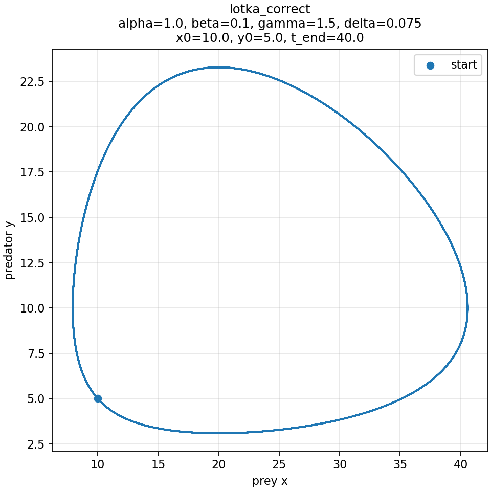
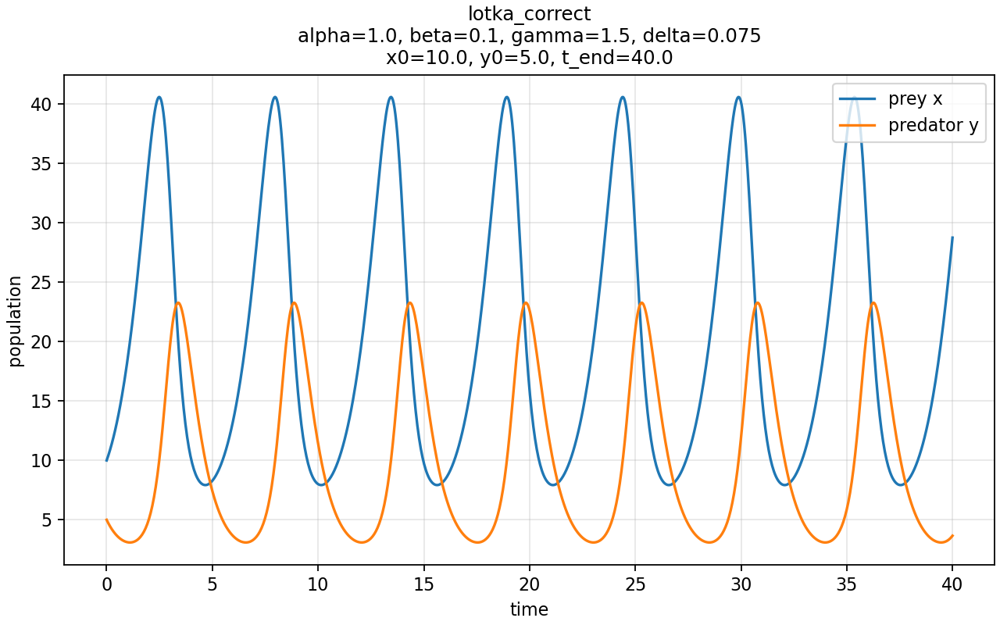
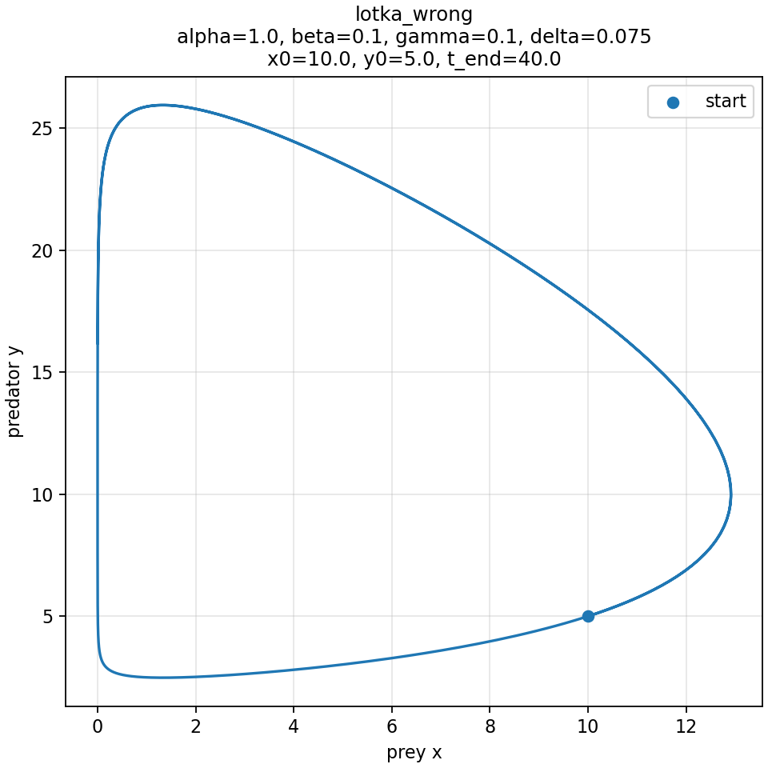
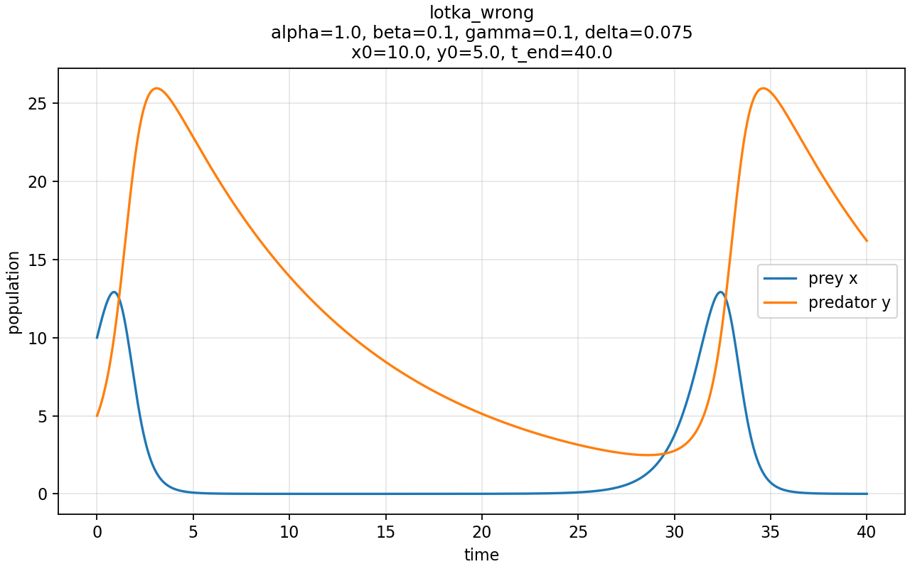

# Lotka Volterra equation solution incorrect

The solver seems to work, but produces and incorrect solution. For example,
for
- $x$: 0.1
- $y$: 0.2
- $\alpha$: 1.0
- $\beta$: 0.1
- $\delta$: 0.075
- $\gamma$: 1.5

the solution normally looks like this:

but with the curren version of the code, I get:

I could not find the problem myself, I only know that it worked with the last version of the app that I had and after the last update it doesn't.
I have added the last good trajectory I had saved for this parameter combination in
`lotka_correct_trajectory.csv`.